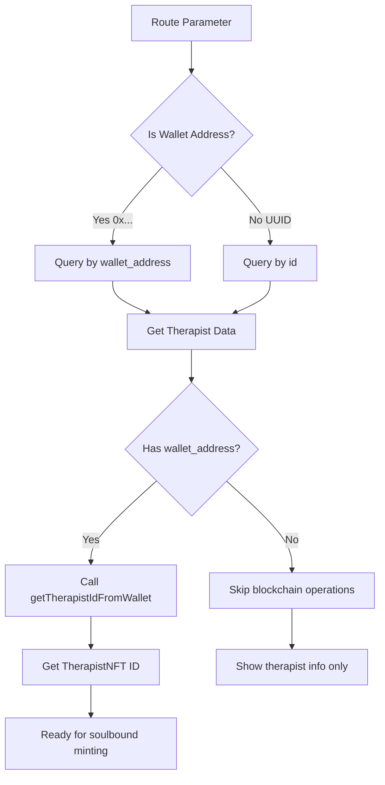

# 🔧 Wallet Address Routing Fix

## 🐛 Problem Identified

The error you encountered was due to a mismatch between route expectations and data types:

```
❌ Error in getTherapistIdFromWallet: Error: Invalid wallet address format
```

**Root Cause:** 
- The route `/marketplace/[walletAddress]` was being called with a therapist UUID (`1add72c5-5605-4457-b620-12a97d47d671`) instead of a Sui wallet address (`0x...`)
- The `getTherapistIdFromWallet()` function expects a valid Sui wallet address format

## ✅ Solution Implemented

### 1. **Enhanced Therapist Service**

Added new functions to `src/lib/therapistService.ts`:

```typescript
// Get therapist by wallet address
export async function getTherapistByWalletAddress(walletAddress: string): Promise<TherapistWithSpecializations | null>

// Helper to detect wallet vs UUID
export function isWalletAddress(id: string): boolean {
  return id.startsWith('0x') && id.length === 66;
}

// Smart lookup - handles both wallet addresses and UUIDs
export async function getTherapistByIdOrWallet(identifier: string): Promise<TherapistWithSpecializations | null> {
  if (isWalletAddress(identifier)) {
    return getTherapistByWalletAddress(identifier);
  } else {
    return getTherapistById(identifier);
  }
}
```

### 2. **Updated Marketplace Page**

Modified `src/app/marketplace/[walletAddress]/page.tsx`:

```typescript
// ✅ Now handles both wallet addresses and UUIDs
const therapistData = await getTherapistByIdOrWallet(walletAddress);

// ✅ Gets actual wallet address for blockchain operations
const actualWalletAddress = therapist.wallet_address || (isWalletAddress(walletAddress) ? walletAddress : null);

// ✅ Only calls wallet service with valid wallet addresses
if (actualWalletAddress) {
  const therapistId = await getTherapistIdFromWallet(actualWalletAddress);
}
```

### 3. **Improved Error Messages**

Enhanced `src/lib/therapistWalletService.ts`:

```typescript
// ✅ Better validation and error messages
if (!therapistWalletAddress.startsWith('0x')) {
  throw new Error(`Invalid wallet address format: expected address starting with 0x, got: ${therapistWalletAddress}`);
}

if (therapistWalletAddress.length !== 66) {
  throw new Error(`Invalid wallet address length: expected 66 characters, got: ${therapistWalletAddress.length}`);
}
```

## 🚀 How It Works Now

### Route Usage Examples:

1. **With Wallet Address** (for therapists who have minted NFTs):
   ```
   /marketplace/0x1234567890abcdef1234567890abcdef1234567890abcdef1234567890abcdef
   ```

2. **With Therapist UUID** (for therapists in database):
   ```
   /marketplace/1add72c5-5605-4457-b620-12a97d47d671
   ```

### Flow Logic:



## 🔍 Testing the Fix

### 1. **Test with Therapist UUID** (should work without blockchain calls):
```
http://localhost:3000/marketplace/1add72c5-5605-4457-b620-12a97d47d671
```
**Expected behavior:**
- ✅ Loads therapist info from database
- ⚠️ Skips wallet verification (logs "No wallet address available")
- ✅ Shows therapist profile and sessions

### 2. **Test with Wallet Address** (full blockchain integration):
```
http://localhost:3000/marketplace/0x1234567890abcdef1234567890abcdef1234567890abcdef1234567890abcdef
```
**Expected behavior:**
- ✅ Looks up therapist by wallet_address
- ✅ Calls getTherapistIdFromWallet()
- ✅ Verifies TherapistNFT in kiosk
- ✅ Ready for soulbound minting

## 🎯 Key Improvements

1. **✅ Backward Compatibility**: Still works with existing UUID-based routes
2. **✅ Forward Compatibility**: Supports wallet address routes for full blockchain integration
3. **✅ Better Error Handling**: Clear messages about what went wrong
4. **✅ Smart Detection**: Automatically detects address type
5. **✅ Graceful Degradation**: Shows therapist info even without blockchain features

## 📋 Next Steps

To complete the integration:

1. **Update navigation links** to use wallet addresses when available:
   ```typescript
   // In therapist listings, prefer wallet_address over id
   const therapistRoute = therapist.wallet_address || therapist.id;
   <Link href={`/marketplace/${therapistRoute}`}>
   ```

2. **Add wallet address display** in therapist profiles:
   ```typescript
   {therapist.wallet_address && (
     <p className="text-sm text-gray-500">
       Wallet: <code className="bg-gray-100 px-1 rounded">{therapist.wallet_address}</code>
     </p>
   )}
   ```

3. **Indicate blockchain features** availability:
   ```typescript
   {walletVerified ? (
     <Badge className="bg-green-100 text-green-800">Blockchain Verified</Badge>
   ) : (
     <Badge className="bg-gray-100 text-gray-600">Database Only</Badge>
   )}
   ```

The marketplace now robustly handles both wallet addresses and UUIDs, providing a smooth user experience regardless of how therapists are accessed!
